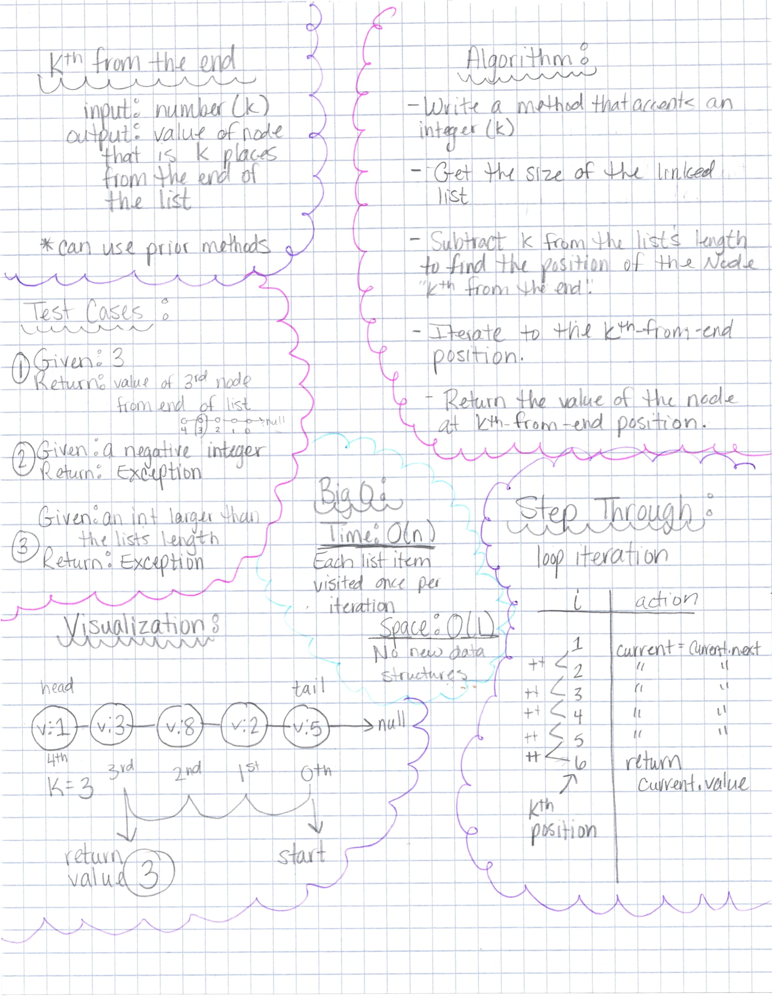
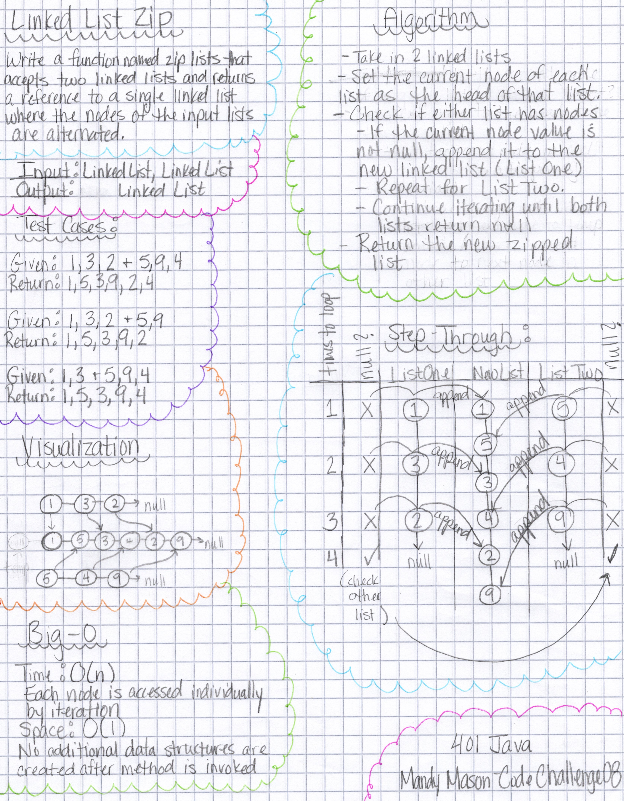

# Data Structures

## Implementation Notes

## Code Challenges

### Code Challenge 05

#### Linked Lists

Location: `codechallenges/linkedlist/LinkedListChallenges`

Methods:
`insert()` - Adds a new node with the given value to the head of the list.

`includes()` - Indicates whether the given value exists as a Node's value somewhere within the list.

`toString()` - (Override) Returns a string representing all the values in the Linked List

### Code Challenge 06
Challenge description: Extend a Linked List to allow various insertion methods

`append()` - Adds a node with the given value to the end of the Linked List.

`insertBefore()` - Inserts a node with the given new value to a position immediately before a node with the given existing value.

`insertAfter()` - Inserts a node with the given new value to a position immediately after a node with the given existing value.

`delete()` - Deletes a node with a given value from the Linked List.

#### Efficiency

*Big-O analysis for each of the above methods:*
Time complexity: O(n) - Each node will be visited once at most.
Space complexity: O(1) - No new data structures are created.

#### Whiteboard

#### Implementation

To utilize `append`, `insertBefore`, `insertAfter`, and `delete`, call them on an instantiated linked list with the required parameters.
*example: `linkedList.append(value)`*

### Code Challenge 07

`kthFromEnd()` - Finds the value of a Node that is k positions from the end of the list, where k is a given integer.

### Code Challenge 08

`zipLists()` - Takes in two Linked Lists, and returns a single Linked List with
the given Lists zipped together by alternating their nodes.

### Code Challenge 10

#### Stacks

Methods:

`push()` - Adds a node to the top of the stack
`pop()` - Removes a node from the top of the stack, and returns its value
`peek()`- Returns the value of the top node
`isEmpty` - Returns true if the stack is empty

#### Queues

`enqueue()` - Adds a node to the rear of the queue
`dequeue()` - Removes a node from the front of the queue
`peek()` - Returns the value of the front node
`isEmpty()` - Returns true if the queue is empty

### Code Challenge 11

#### Pseudo Queue

Creates queue functionality (FIFO) using two stacks.

Methods:

`enqueue()` - Inserts a given value into the PseudoQueue using a FIFO approach. O(1) complexity
`dequeue()` - Extracts a value from the PseudoQueue using a FIFO approach. O(n)
complexity.

### Code Challenge 12

#### Animal Shelter (pseudo queue)

Methods:

`enqueue()` - Adds an animal of type "cat" or "dog" to the animal shelter queue
`dequeue()` - Accepts a preference of 'dog' or 'cat', and returns an animal of
the specified type

*CC12 collaboration: Stanley Wilder*

### Code Challenge 13

#### Validate Brackets

Method:

`validateBrackets()` - Accepts a string of characters, and returns true if the
string contains complete sets of opening and closing brackets, regardless of
other characters in the string.
Time Complexity - O(n)
Space Complexity - O(n)

### Code Challenge 15

#### Trees

Classes:
`TNode` - value, left, and right properties
`Binary Tree`
    Methods:
    `preOrder()` - returns an array of values with the root value first
    `inOrder()` - returns an array of values with the root value in the middle
    `postOrder()` - returns an array of values with the root value at the end

`Binary Search Tree`
sub-class of `Binary Tree`
    Methods:
    `add()` - Accepts a value and adds a node to the Binary Search Tree in the
              proper location
    `contains()` - Accepts a value and returns a boolean which indicates if the
                   given value is contained within the Binary Search Tree

Datastructures Attributions:

MisterCode - YouTube
[PseudoQueue Explanation](https://www.youtube.com/watch?v=AN0axYeLue0&t=214s)

Java67.com
[Binary Search Tree Traversal](https://www.java67.
com/2016/07/how-to-implement-preorder-traversal-of-binary-tree-in-java.html)

Joshua Frazer
[GitHub repository](https://github.com/Frazmatic/data-structures-and-algorithms)
Formatting, syntax, and logic help and because I aspire to write code as cleanly and
as organized as this on my own!

Ben Mills
[GitHub repository](https://github.com/akkanben/data-structures-and-algorithms/tree/main/java/datastructures/lib/src/main/java/datastructures/linkedlist)
Formatting, syntax, and logic examples
