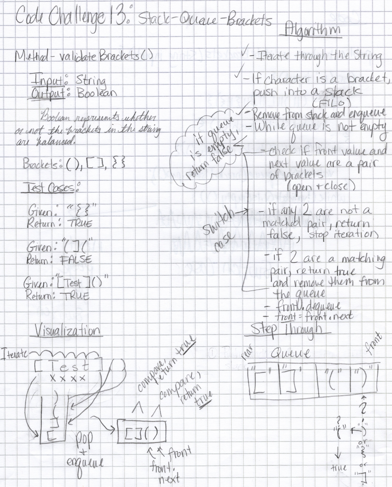

# Data Structures

## Code Challenges

### Code Challenge 05

### Linked Lists

Location: `codechallenges/linkedlist/LinkedListChallenges`

Methods:
`insert()` - Adds a new node with the given value to the head of the list.

`includes()` - Indicates whether the given value exists as a Node's value somewhere within the list.

`toString()` - (Override) Returns a string representing all the values in the Linked List

### Code Challenge 06

### Linked Lists

Challenge description: Extend a Linked List to allow various insertion methods

#### Methods:

`append()` - Adds a node with the given value to the end of the Linked List.
`insertBefore()` - Inserts a node with the given new value to a position immediately before a node with the given existing value.
`insertAfter()` - Inserts a node with the given new value to a position immediately after a node with the given existing value.
`delete()` - Deletes a node with a given value from the Linked List.

#### Efficiency

*Big-O analysis for each of the above methods:*
Time complexity: O(n) - Each node will be visited once at most.
Space complexity: O(1) - No new data structures are created.

#### Whiteboard

#### Implementation

To utilize `append`, `insertBefore`, `insertAfter`, and `delete`, call them on an instantiated linked list with the required parameters.
*example: `linkedList.append(value)`*

### Code Challenge 07

### Linked Lists

`kthFromEnd()` - Finds the value of a Node that is k positions from the end of the list, where k is a given integer.

#### Efficiency

*Big-O analysis for each of the above methods:*
Time complexity: O(n) - Each node will be visited once at most.
Space complexity: O(1) - No new data structures are created.

#### Whiteboard

#### Implementation

To utilize `kthFromEnd`, call on an instantiated linked list with the required parameters.
*example: `linkedList.kthFromEnd(value)`*

### Code Challenge 08

### Linked Lists

`zipLists()` - Takes in two Linked Lists, and returns a single Linked List with
the given Lists zipped together by alternating their nodes.

#### Efficiency

*Big-O analysis for each of the above methods:*
Time complexity: O(n^2) - During each list iteration, the append method is called, which iterates through a list to add a node.
Space complexity: O(1) - `zipLists` will always accept two linked lists and return one linked list.

#### Whiteboard

#### Implementation

To utilize `zipLists`, pass in two existing linked lists as arguments.
*example: `zipLists(listOne, listTwo0)`*

### Code Challenge 10

### Stacks & Queues
Challenge Description: Using a Linked List as the underlying data storage mechanism, implement a Stack and a Queue.

#### Stacks Methods:

`push()` - Adds a node to the top of the stack
`pop()` - Removes a node from the top of the stack, and returns its value
`peek()`- Returns the value of the top node
`isEmpty` - Returns true if the stack is empty

#### Queues Methods:

`enqueue()` - Adds a node to the rear of the queue
`dequeue()` - Removes a node from the front of the queue
`peek()` - Returns the value of the front node
`isEmpty()` - Returns true if the queue is empty

#### Efficiency

All Stack and Queue methods:
Time complexity: O(1) - Methods will take the same amount of time regardless of input
Space complexity: O(1) - No new data structures are created

#### Implementation

To utilize `push` and `enqueue`, call on an instantiated stack or queue respectively, and pass in the value of the new node to be added.
*example: `myQueue.enqueue(value)`*

To utilize all other methods on stacks and queues, call on an instantiated stack or queue.
*example: `myStack.pop()`

### Code Challenge 11

### PseudoQueue

#### Challenge Description:
Creates queue functionality (FIFO) using two stacks.

#### Methods:

`enqueue()` - Inserts a given value into the PseudoQueue
`dequeue()` - Extracts a value from the PseudoQueue

#### Efficiency

**Enqueue**
Time Complexity: O(1) - Will add a single node every time
Space Complexity: O(1) - No new data structures are created

**Dequeue**
Time Complexity: O(n) - May visit each node in the stack to locate given input value
Space Complexity: O(1) - No new data structures are created

#### Implementation
To utilize `enqueue`, call on an instantiated PseudoQueue with a value argument
*example: `pseudoQueue.enqueue(value)`

To utilize `dequeue`, call on an instantiated PseudoQueue

### Code Challenge 12

### Animal Shelter (pseudo queue)

#### Challenge Description

Create a class called AnimalShelter which holds only cats and dogs, operates using a FIFO approach, and contains enqueue and dequeue methods.

#### Methods:

`enqueue()` - Adds an animal of type "cat" or "dog" to the animal shelter queue
`dequeue()` - Accepts a preference of "cat" or "dog", and returns an animal of the specified type

#### Efficiency

**Enqueue**
Time Complexity: O(1) - Time will be constant regardless of the input
Space Complexity: O(1) - No new data structures are created

**Dequeue**
Time Complexity: O(n) - May visit each node in the pseudoqueue to locate an animal of the given preference
Space Complexity: O(1) - No new data structures are created

#### Implementation
To utilize `enqueue`, call on an instantiated PseudoQueue with an animal type argument
*example: `pseudoQueue.enqueue("dog")`

To utilize `dequeue`, call on an instantiated PseudoQueue with an animal type preference ("dog" or "cat")
*example: `pseudoQueue.dequeue("dog")`

***CC12 collaboration: Stanley Wilder***

### Code Challenge 13

### Validate Brackets

#### Challenge Description

`validateBrackets()` - Accepts a string of characters, and returns true if the
string contains complete sets of opening and closing brackets, regardless of
other characters in the string.

#### Efficiency

Time Complexity: O(n^2) - While the queue size is greater than 1, a switch statement is run to determine if a set of brackets is present
Space Complexity:  O(n) - Characters from the given input are passed into a Stack and a Queue for validation

#### Whiteboard

#### Implementation

To utilize `validateBrackets`, call the method and pass in a string
*example: `validateBrackets("[some]{text}here")`

### Code Challenge 15

#### Trees

Classes:
`TNode` - value, left, and right properties
`Binary Tree`
    Methods:
    `preOrder()` - returns an array of values with the root value first
    `inOrder()` - returns an array of values with the root value in the middle
    `postOrder()` - returns an array of values with the root value at the end

`Binary Search Tree`
sub-class of `Binary Tree`
    Methods:
    `add()` - Accepts a value and adds a node to the Binary Search Tree in the
              proper location
    `contains()` - Accepts a value and returns a boolean which indicates if the
                   given value is contained within the Binary Search Tree

Datastructures Attributions:

MisterCode - YouTube
[PseudoQueue Explanation](https://www.youtube.com/watch?v=AN0axYeLue0&t=214s)

Java67.com
[Binary Search Tree Traversal](https://www.java67.
com/2016/07/how-to-implement-preorder-traversal-of-binary-tree-in-java.html)

Joshua Frazer
[GitHub repository](https://github.com/Frazmatic/data-structures-and-algorithms)
Formatting, syntax, and logic help and because I aspire to write code as cleanly and
as organized as this on my own!

Ben Mills
[GitHub repository](https://github.com/akkanben/data-structures-and-algorithms/tree/main/java/datastructures/lib/src/main/java/datastructures/linkedlist)
Formatting, syntax, and logic examples
