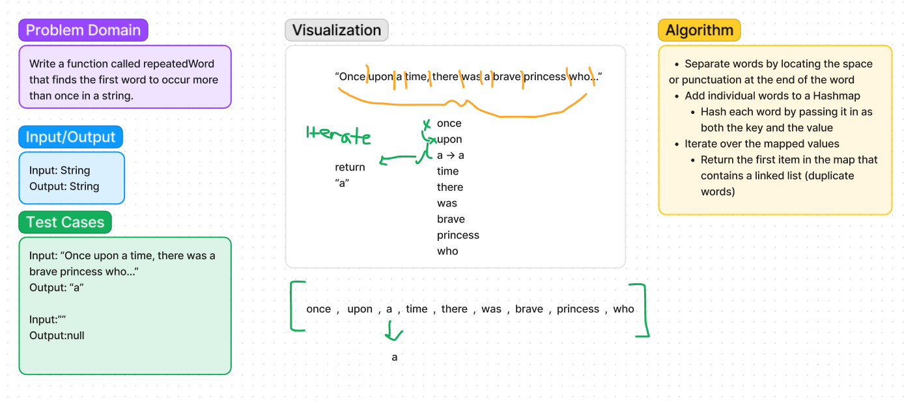

# Hashmap

## Code Challenge 30

### Challenge Description

New implementation. Implement a hashmap class with the methods `set()`, `get()`,
`contains()`, `keys()`, and `hash()`.

### Methods with description

`set()`: Accepts a key and a value as arguments, no return. Hashes the key, and
sets the key/value pair into a hashmap.

`get()`: Accepts a key as an argument, and returns the associated value from the
hashmap.

`contains()`: Accepts a key as an argument, returns a boolean indicating if that
key exists in the hashmap.

`keys()`: Accepts no arguments, when called on a hashmap, returns a collection of
keys from that hashmap.

`hash()`: Accepts a key as an argument, returns the index of that key in the hashmap.

### Big-O with description
`set()`

**Time:** O(n) - It is possible that each node in the linked list will be visited to
check for the given key
**Space:** O(1) - The same amount of space will always be created for the given
key/value pair

`get()`

**Time:** O(n) - It is possible that each element in the map will be visited
to check for and retrieve the given key.
**Space:** O(1) - No additional data structures are created

`contains()`

**Time:** O(n) - It is possible that each element in the map will be visited to
check for the given key.
**Space:** O(1) - No new data structures are being created.

`keys()`

**Time:** O(n) - All buckets in the hashmap will be iterated over and added to a
new array.
**Space:** O(n) - One additional data structure is created of an unknown length.

`hash()`
**Time:** O(1) - A basic mathematical operation is all that is being performed.
**Space:** O(1) - No additional data structures are created

### Implementation instructions

To utilize `set()`, call on an instantiated HashMap, and pass in the key/value
pair to be added.
*example*: `map.set(3,4)`

To utilize `get()` and `contains()`, call on an instantiated HashMap, and pass in
the key that you wish to get the value for, or to check if it is contained within
the map.
*example*: `map.get(3)` / `map.contains(3)`

To utilize `keys()`, call on an instantiated HashMap. No arguments are needed.

*example*: `map.keys()`

## Code Challenge 31

### Challenge Description

Write a method that finds the first word to occur more than once in a string.

### Method

`repeatedWord()`: Accepts a string, and returns another string containing the
first word to be repeated in the input string.

### Whiteboard

### Big-O
**Time**:O(n^2) - `repeatedWord` will potentially iterate through each item in the
Hashmap to determine if a given word is contained, and will potentially check
every word in the input string.

**Space**: O(n) - A Hashmap of unknown size (dependent upon the length of the input
string) is created to store each word of the input.

### Implementation

To utilize `repeatedWord`, pass in a string as an argument.
*example*: `repeatedWord("Once upon a time, there was a brave princess who...")`.
The method will return "a".

### Attributions

Alex White - Starter Code   
Ben Mills - [GitHub Repo](https://github.com/akkanben/data-structures-and-algorithms)

