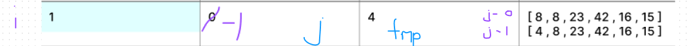
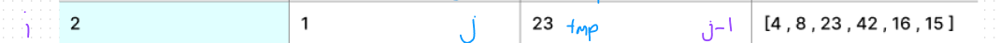
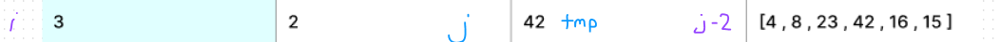
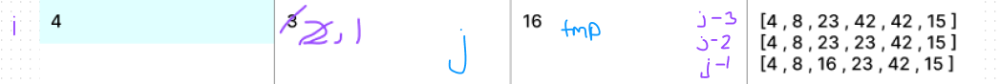
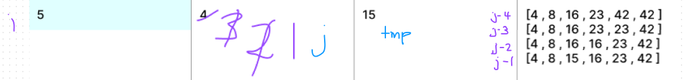
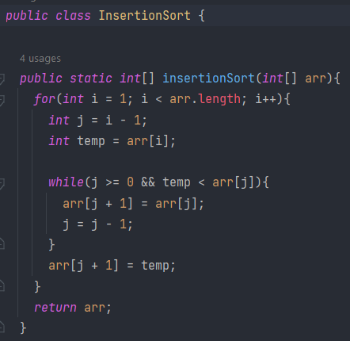

# InsertionSort

Insertion Sort is a method that takes in an array of integers, and returns that
same array, sorted by value from least to greatest. The traversal compares each
element in the array to the other values, and keeps track of the value it is
comparing in a temporary variable.

## Pseudo Code

```
InsertionSort(int[] arr)

    FOR i = 1 to arr.length

      int j <-- i - 1
      int temp <-- arr[i]

      WHILE j >= 0 AND temp < arr[j]
        arr[j + 1] <-- arr[j]
        j <-- j - 1

      arr[j + 1] <-- temp
```

## Trace

Pass 1



In the first pass through the sorting method, we evaluate the value of the
integers at the first and second positions of the array. We find that the first
value is greater than the second value, and replace the value at index 1 with the
value at index 0. The value of the temporary variable is now equal to the value
at index 0, so we break out of the while loop, and replace the value at index 0
with the temp value.

Pass 2



On the second pass, we evaluate the integers at the second and third positions of
the array. We find that the second value is less than the third value, and do not
make any changes to our array.

Pass 3



Just as in the second pass, in the third pass, we evaluate the integers at the
third and fourth
positions of
the array. We find that the third value is less than the fourth value, and do not
make any changes to our array.

Pass 4



In the fourth pass, we evaluate the integers at the fourth and fifth positions of
the array. We find that the value of the fifth position is less than the value of
the fourth position, and replace the value at index 4 with the value at index 3.
The value of the temporary variable is now less than the value at index 3, so we
replace the value at index 3 with the value at index 2. The value of temp is
still less than the value at index 2, so we replace the value of index 2 with the
temp value.

Pass 5



In the final pass, a similar process to pass 4 occurs, where the temporary value
is less than the values at indexes 5,4,3, and 2. These values are replaced by the
value at the previous index until we reach index 2, which is replaced by the temp
variable.

## Code




## Efficiency

*Time:* O(n^2) - While iterating over the array, we are iterating over the array
again at index (i-1) to determine proper ordering of values in the array. In the
worst case scenario, every value in the array is compared to every other value (n
* n-1)

*Space:* O(1) - No new data structures are being created. The array is being
sorted in place.
