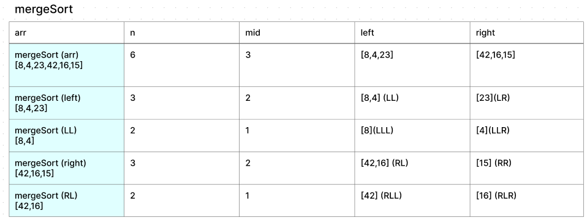
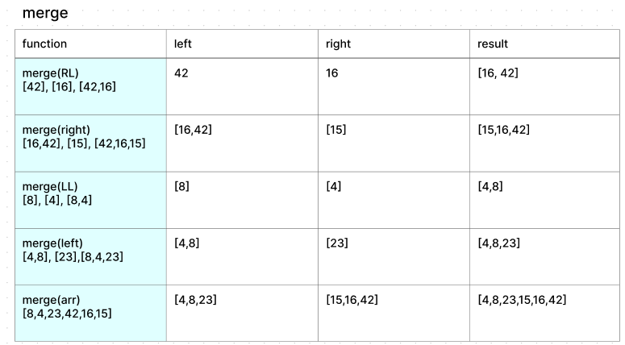
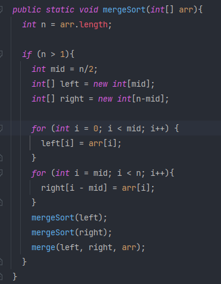
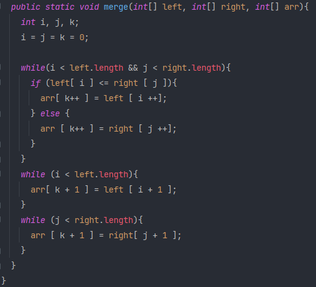

# MergeSort

Merge Sort contains a pair of methods - `mergeSort()` and `merge()`.

`mergeSort()` is a recursive method which accepts an array of integers, and
breaks the given array
into a set of arrays, each containing one integer from the given array. It
then calls on the `merge()` method which re-combines those arrays with the values
sorted from least to greatest.

## Pseudo Code

### mergeSort

```
ALGORITHM Mergesort(arr)
    DECLARE n <-- arr.length

    if n > 1
      DECLARE mid <-- n/2
      DECLARE left <-- arr[0...mid]
      DECLARE right <-- arr[mid...n]
      // sort the left side
      Mergesort(left)
      // sort the right side
      Mergesort(right)
      // merge the sorted left and right sides together
      Merge(left, right, arr)
```

### merge

```
ALGORITHM Merge(left, right, arr)
    DECLARE i <-- 0
    DECLARE j <-- 0
    DECLARE k <-- 0

    while i < left.length && j < right.length
        if left[i] <= right[j]
            arr[k] <-- left[i]
            i <-- i + 1
        else
            arr[k] <-- right[j]
            j <-- j + 1

        k <-- k + 1

    if i = left.length
       set remaining entries in arr to remaining values in right
    else
       set remaining entries in arr to remaining values in left
```

## Trace





## Code





## Efficiency

*Time*: O(n*log n) - For each recursive call, the number of elements visited in
the array is halved, resulting in a complexity of log n, and the number of elements
to be visited for each recursive call is n, resulting in a total time of n*log n.

*Space* O(n) - A variable amount of sub-arrays will be created in each recursive
call (n arrays). The number of recursive calls is log n, making the space
complexity O(n) + O(log n), which reduces to O(n).
