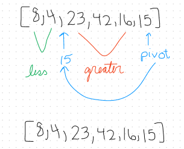
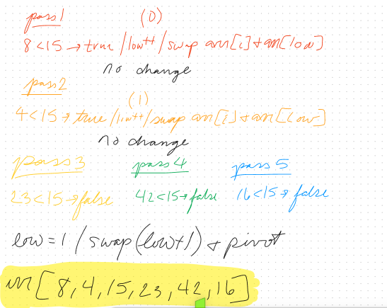
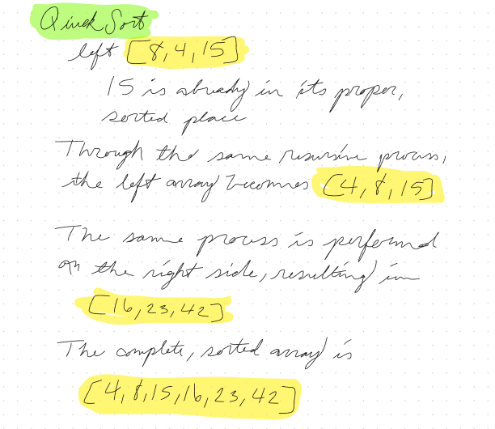
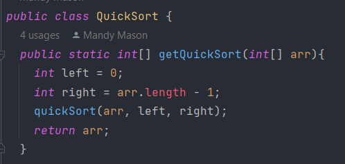
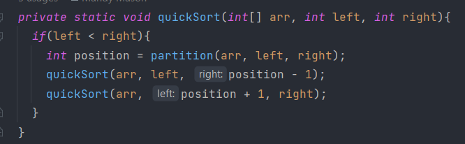
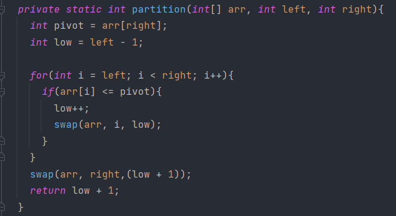
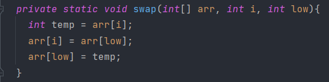

# Quick Sort

`quickSort` contains four methods:

`getQuicksort()`: Declares the initial left value as 0 (the first position in the
given array), and the right value as the last position in the given array. Calls
the `quickSort` method on the given array, kicking off a series of recursive
calls to the `quickSort` method.

`quickSort()`: Evaluates whether the left value from `getQuickSort` is less than
the right value. If so, implements the `partition` method to determine a new left
or right value to recursively pass in to the `quickSort` method.

`partition()`: Declares a pivot point, and separates elements in the given array
based on whether they are greater or less than the value of the pivot. Calls the
`swap` method to move elements appropriately.

`swap()`: Swaps specified element in the given array

## Pseudo Code

### quickSort

```
ALGORITHM QuickSort(arr, left, right)
    if left < right
        // Partition the array by setting the position of the pivot value
        DEFINE position <-- Partition(arr, left, right)
        // Sort the left
        QuickSort(arr, left, position - 1)
        // Sort the right
        QuickSort(arr, position + 1, right)
```

### partition

```
ALGORITHM Partition(arr, left, right)
    // set a pivot value as a point of reference
    DEFINE pivot <-- arr[right]
    // create a variable to track the largest index of numbers lower than the defined pivot
    DEFINE low <-- left - 1
    for i <- left to right do
        if arr[i] <= pivot
            low++
            Swap(arr, i, low)

     // place the value of the pivot location in the middle.
     // all numbers smaller than the pivot are on the left, larger on the right.
     Swap(arr, right, low + 1)
    // return the pivot index point
     return low + 1
```

### swap

```
ALGORITHM Swap(arr, i, low)
    DEFINE temp;
    temp <-- arr[i]
    arr[i] <-- arr[low]
    arr[low] <-- temp
```

## Trace







## Code









## Efficiency

*Time*: O(n^2) - Because it is an unstable sorting algorithm, the worst case time
efficiency is O(n^2) due to potentially visiting and sorting every element inside
of the recursive method calls.

*Space:* O(1) - A set number of sub arrays is created for partitioning in the
recursive method calls.
