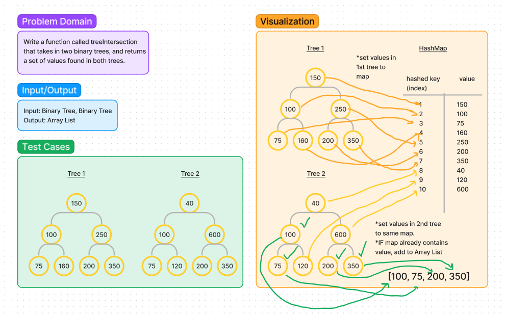

# Tree Intersection

## Code Challenge 32

### Challenge Description

Write a method called `treeIntersection` that takes in two binary trees, and
returns a set of values found in both trees.

### Method description

`treeIntersection()`: Accepts two binary trees as arguments, adds the values from
the trees into an array list, then sets them into a the same HashMap. If a value
from the second binary tree is already contained in the HashMap, it is added to a
results array list, which is then returned.

### Whiteboard

### Complexity

**Time**: O(n^2) - Each list of items from both binary trees are added
iteratively, and potentially set to a new index in the hashmap.

**Space**: O(n) - A new hashmap is created of unknown size, depending on how many
values occur in both binary trees.

### Implementation

To utilize `treeIntersection()`, pass in two instantiated binary trees containing integers.
*example*: `treeIntersection(tree1, tree2)`

### Attributions

Lucy Gelderloos - Testing layout [GitHub Repo](https://github.com/lucy-gelderloos/data-structures-and-algorithms/blob/main/java/datastructures/lib/src/test/java/datastructures/treeintersection/TreeIntersectionTest.java)
